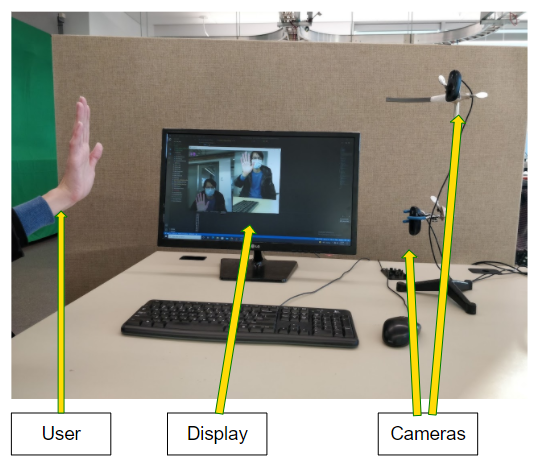
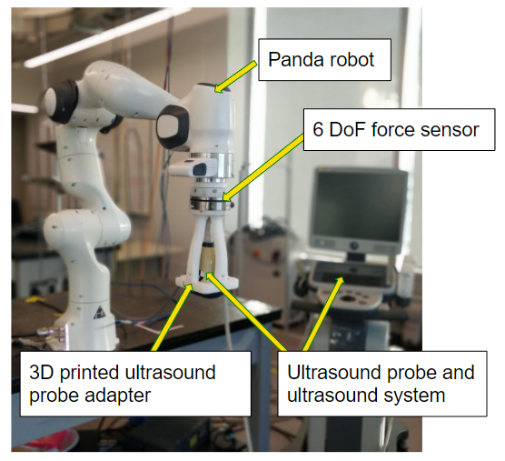

# Hand Position-Based Robot Control for Tele-Sonography

This is the repository hosting code and other relative files of the course project for ECE 740 Computer and Robot Vision (Fall 2021).

In this course project, we designed a system that utilizes computer vision to detect the movements of a user’s hand in free space which will be interpreted to control the robot’s manipulation of the US probe on the patient. With this system, the sonographer can remain at a distance or behind a plastic screen to observe the robot’s movements and the US feed in real-time and make adjustments as necessary. 

| Master site                                      | Slave Site                                      |      |
| ------------------------------------------------ | ----------------------------------------------- | ---- |
|  |  |      |


## Requirements

For the Master Site, please also refer to `requirements.txt`. 

```
mediapipe==0.8.7.3
numpy==1.21.2
opencv-python==4.5.3.56
Pillow==8.3.2
scikit-learn==1.0.1
```

For the Slave Site, MATLAB Simulink R2019a should be used. 

